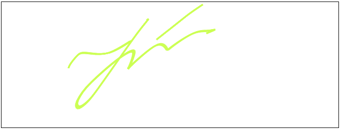

canvas-realistic-pen
====================

Library  for smooth pen-like drawing on canvas written in vanilla JavaScript
-----------------------------------------------



This is refactored and enhanced version of code taken from this post: http://stackoverflow.com/a/10661872/2248909

Authors: 
--------
  - mrdob.com
  - Alex <http://stackoverflow.com/users/873836/alex>
  - Alexey Pedyashev

Options:
--------
  penColor       -  Color of the pen. Allowed formats: 
                    Array - [0, 0, 0], Hex - #ccc, #cfc4c1, rgb(1, 2, 3), rgba(1, 2, 3, 0)
  - brushPressure: - opacity of line
  - brushSize:     - widht of line
  - brushesCount   - Count of lines that will be used to draw

Interface:
----------
  - destroy()                           - destroys the pen
  - setPenColor(inColor)                - sets penColor 
  - setBrushPressure(inBrushPressure)   - sets brushPressure
  - setBrushSize(inBrushSize)           - sets brushSize
  - setBrushesCount(inBrushesCount)     - sets brushesCount

Example:
--------
```JavaScript
  var canvas          = document.getElementById('draw-canvas');
  brush = new RealisticPen(canvas, {
      penColor: [217, 101, 110],
      brushPressure: 1,
      brushSize: 3,
      brushesCount: 5
  });
  brush.setPenColor('#cfa');
  brush.setBrushSize(5);
```

